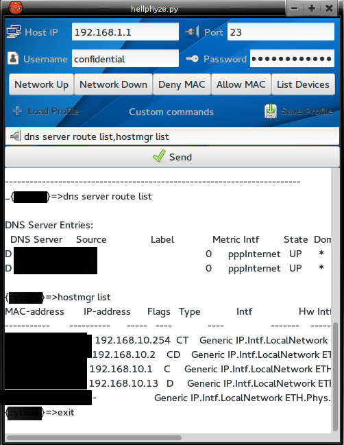

Hellphyze
=====
 
Python gui telnet client. Keep in mind that I've wrote it for Thomson TG582 and TG585. If your server or router is other brand or model, you should re-write the commands that are defined to the buttons or just use the "custom commands" field.
To use multiple custom commands separate them with a comma: command1,command2,command3,command4

Thanks to <a href="http://FilmsByKris.com" target="_blank">Chris Occhipinti</a> for the given inspiration - https://www.youtube.com/watch?v=fIOk2EcgOI8 this is the video which made me to create the program.
## Requirements

* python2
* gpg (for saving and loading profiles)
* python-gobject (for debian is python-gi)
* webkitgtk, pywebkitgtk